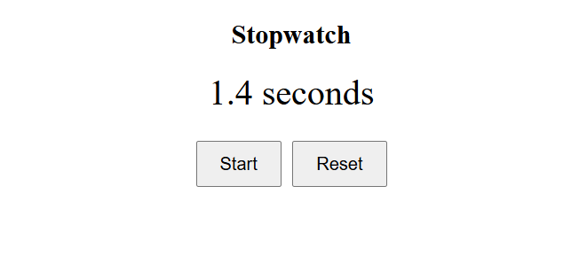

# Angular Stopwatch ⏱️

This is a simple Angular 19 project that demonstrates interval-based state updates, event binding, and conditional rendering using a functional stopwatch layout. The stopwatch allows users to start, stop, and reset a timer that displays the elapsed time with precision.

---

## 🔧 What I Built

I developed a responsive **Stopwatch** component using:

- Angular CLI 19.1.8
- Component-based architecture
- Event binding with `(click)`
- Conditional logic and time formatting
- Basic HTML + SCSS styling with clean UI

---

## 💡 Key Features

- Start/Stop toggle functionality
- Reset button that clears the elapsed time
- Dynamic label switching (Start ↔ Stop)
- Time formatted to 1 decimal place using Angular's `number` pipe
- Timer updates every 100ms (0.1 seconds)
- Disable reset button when timer is at 0

---

## 🧱 Technologies Used

- **Angular 19**
- **TypeScript**
- **HTML & SCSS**
- **Standalone Components**
- **setInterval / clearInterval** logic
- **Angular `number` pipe** for formatting

---

## 📁 Project Structure

```plaintext
src/
├── app/
│   └── stopwatch/
│       ├── stopwatch.component.ts       # Logic for stopwatch functionality
│       ├── stopwatch.component.html     # UI with buttons and elapsed time
│       ├── stopwatch.component.scss     # Styling for layout and buttons

```

## 📸 Screenshot



---

## 🚀 Running the Project

To start the development server, run:

```bash
ng serve
